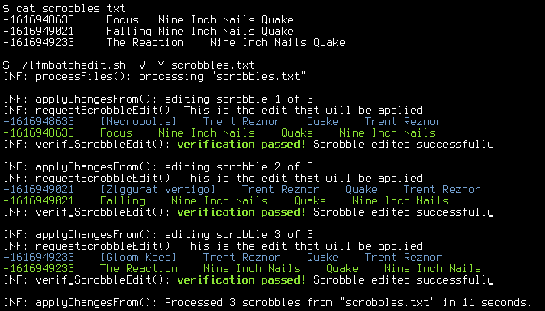

# lfmedit

Last.fm subscribers have the ability to edit their scrobbles, i.e. to update the
title, artist, album or album artist of a scrobble. This can only be done using
Last.fm website UI, at the time of writing there is no Last.fm API method for
editing scrobbles.

`lfmedit.sh` and `lfmbatchedit.sh` allow sending scrobble edit requests from the
command line, which makes it possible to automate the editing process.

## Using the scripts

### Requirements

* `bash`
* `curl`
* `jq`
* `bc`
* Last.fm subscription

### Authentication

Only an authenticated Last.fm subscriber is authorized to edit scrobbles. The
scripts mimic the behavior of the website sending edit requests to Last.fm
backend, so they require the same set of authentication tokens:

* Last.fm username
* session ID
* CSRF token

The username is not a problem, but obtaining the other two tokens is not as
straightforward. Session ID and CSRF token are created at login and stored in
browser cookies. It's possible to get them using the browser developer console
(F12 in Firefox or Chrome). Copy the values of cookies `sessionid` and `csrftoken`,
and set the relevant variables in `lfmedit/auth_tokens` in your user's config
directory. See the sample file for details.

### Usage examples

#### Change the title and artist of a single scrobble

The parameter `-u` is mandatory because Last.fm seems to be using the Unix timestamp
as scrobble ID. Apart from the timestamp, it's only required to set options
corresponding to fields you want to change - in this example only the title and
artist are modified, the album stays the same. Note that the album artist (last
column) was automatically changed to match the new track artist.

It is possible to remove information (e.g. passing `-b ""` will remove album field
from the scrobble), but it's not allowed to remove artist or title.

#### Edit several scrobbles

Each line in `scrobbles.txt` begins with a `+` character. It is immediately followed by
the Unix timestamp, then by target title, artist and album separated by tabs. Successful
and failed edits are logged to appropriate files. The switch `-Y` disables asking for edit
confirmation. Run the scripts with `-h` switch to get the full list of supported options.

## Known issues / limitations

* `lfmedit.sh` is not very useful, in a way it's just a development version of
  `lfmbatchedit.sh`
* One of the mandatory parameters of scrobble edit request is the original album
  artist. It is not possible to get that piece of information from Last.fm API. The
  scripts try to make an assumption, but there is no guarantee it will be correct.
  If `lfmedit.sh` makes a wrong assumption which causes an edit to fail, it's possible
  to override it using `-Z` command line option.
* "Unknown Date" scrobbles cannot be edited. This is a consequence of getting original
  scrobble data from the API: the timestamps of these scrobbles are artificial and not
  unique, so original scrobble data cannot be retrieved by timestamp query.
* Edit verification is not very reliable - I've seen both false positives and false
  negatives in my testing. For this reason verification is disabled by default. It
  can be enabled using `-V` option.
* It's slow. For each scrobble edit the script sends one Last.fm API request to get
  original scrobble data, then a POST request to edit the scrobble, and another POST
  request to verify the edit. This involves spawning several `curl` and `jq` processes,
  plus the network overhead also plays a role. `lfmbatchedit.sh` sends edit requests
  sequentially, and sometimes Last.fm is slow to respond. Furthermore, at some time
  between May 2022 and May 2023 Last.fm implemented rate limiting, which required
  adding delays to `lfmbatchedit.sh` to avoid throttling.

## Further development

None. At least not in this repo.

This was supposed to be a quick-and-dirty proof of concept, and this is the reason
it was initially written in Bash. As the handling of errors and edge cases grew more
complex, I realised this needs to be rewritten in a different programming language.
I intend to do that when I find more time.

If any bugs are reported I'll look into fixing them, but I don't want to add more
features to Bash implementation.
